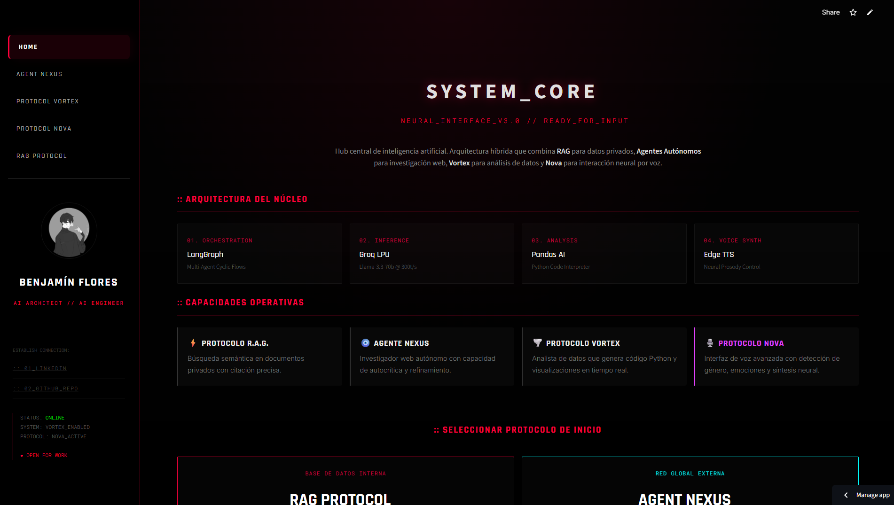

# 🔴 SYSTEM_CORE // NEURAL_INTERFACE_V3.0

> **Arquitectura modular de Inteligencia Artificial diseñada para la orquestación de agentes, análisis de datos avanzado e interfaz de comunicación neural.**

---

## :: VISIÓN GENERAL
**System Core** es un ecosistema de IA de alto rendimiento que integra múltiples protocolos de procesamiento para transformar la interacción humano-máquina. Desarrollado como el eje central de mi transición profesional hacia la **Ingeniería de GenAI**, este sistema prioriza la velocidad de inferencia, la seguridad de los datos y una estética **Tron High-End** diseñada para entornos de misión crítica.

---

## :: PROTOCOLOS DE OPERACIÓN

| PROTOCOLO | ESPECIALIDAD | TECNOLOGÍA CLAVE |
| :--- | :--- | :--- |
| **⚡ RAG_PROTOCOL** | Análisis semántico de documentos privados con citación técnica precisa. | ChromaDB & Llama 3.3 |
| **🧿 AGENTE_NEXUS** | Investigador web autónomo con bucles de autocrítica y refinamiento de búsqueda. | Tavily API & ReAct Logic |
| **🌪️ PROTOCOLO_VORTEX** | Analista de datos con sandbox de Python para generación de código y visualización. | PandasAI & LPU Inference |
| **🎙️ PROTOCOLO_NOVA** | Interfaz de voz avanzada con detección neural de género, emociones y prosodia. | Whisper-v3 & Edge TTS |

---

## :: ARQUITECTURA TÉCNICA (DEEP DIVE)

### 🧠 Inferencia de Baja Latencia
El sistema está optimizado para la toma de decisiones en tiempo real utilizando la infraestructura de **Groq LPU**, logrando velocidades de hasta **300 tokens por segundo** con modelos Llama 3.3-70B.

### 🎙️ Análisis de Metadatos Vocales (Nova)
A diferencia de los asistentes de voz estándar, **Protocolo Nova** realiza un análisis forense de la entrada de audio para extraer metadatos emocionales y gramaticales (género), adaptando la personalidad de la respuesta mediante una síntesis neural de alta fidelidad.

### 💠 Interfaz de Usuario (UI/UX)
Diseñado bajo una estética de "Terminal de Operaciones", el sistema incluye:
* **Escaneo Láser Dinámico**: Efectos visuales de integridad de sistema al interactuar con módulos.
* **Responsive Design**: Optimización completa para dispositivos móviles, asegurando operatividad internacional.
* **Feedback Háptico Visual**: Núcleos pulsantes que reaccionan a la frecuencia de salida de audio.

---

## :: SEGURIDAD Y PRIVACIDAD
Como **AI Architect**, la gobernanza de datos es innegociable:
* **Caja Negra (Private Repo)**: La lógica de orquestación y los prompts del sistema residen en un repositorio privado para proteger la propiedad intelectual.
* **Zero-Persistence**: El audio capturado se procesa de forma volátil y desaparece tras la sesión; sin almacenamiento persistente.
* **Encrypted Uplink**: Comunicación segura mediante túneles HTTPS/WSS.

  
  

